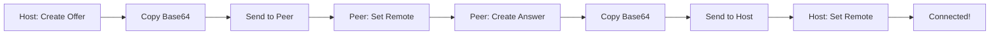

# AIMless

**One HTML file. Zero dependencies. Peer-to-peer chat.**

A 10KB single file WebRTC DataChannel implementation that enables encrypted P2P chat directly in your browser. No server, no build process, no npm. Just open `index.html`, swap codes and start chatting.

```html
<!-- That's it. That's the entire app. -->
<script src="index.html"></script>
```

---

## ✨ Features

- **10KB total** - HTML, CSS, and JavaScript in a single file
- **Zero backend** - No signaling server, no STUN/TURN infrastructure needed
- **Copy-paste connection** - Share connection strings via any text medium
- **Encrypted by default** - WebRTC DTLS encryption built in
- **Dark mode UI** - Clean, modern interface with real-time connection status
- **Robust parsing** - Accepts Base64, JSON, or raw SDP formats

---

## 🚀 Quick Start

### 1. Get the file
just save the HTML file

### 2. Open it
**Option A: Direct file (simplest)**
```bash
# Just double-click index.html
# Works on file:// protocol
```

**Option B: Local server (recommended)**
```bash
# Python
python3 -m http.server 8000

# Node
npx serve .

# Open http://localhost:8000
```

### 3. Connect with a friend
1. **Host** creates offer → copies Base64 → sends to friend
2. **Friend** pastes → sets remote → creates answer → sends back  
3. **Host** sets remote → **connected!** 🎉

---

## 🎮 How It Works

### Connection Flow



### UI Components

The interface shows three connection state pills:

| Pill | States | What it means |
|------|---------|--------------|
| **PC** | `idle` → `connecting` → `connected` | PeerConnection lifecycle |
| **ICE** | `idle` → `checking` → `connected` | NAT traversal progress |
| **DC** | `idle` → `connecting` → `open` | DataChannel ready state |

When all three pills are green, you're chatting P2P!

---

## 🛠️ Technical Implementation

### WebRTC Configuration
```javascript
const rtcConfig = {
  iceServers: [
    { urls: "stun:stun.l.google.com:19302" },
    { urls: "stun:stun1.l.google.com:19302" }
  ],
  iceCandidatePoolSize: 10
};
```

### Signaling Format
The app uses a **non trickle ICE** approach, gathering all candidates before creating the connection blob:

```javascript
// Waits 300ms after last candidate before packaging
pc.onicecandidate = () => {
  clearTimeout(gatherTimer);
  gatherTimer = setTimeout(() => {
    $('local').value = pack(pc.localDescription);
  }, 300);
};
```

### Smart Blob Detection
Automatically detects and parses three formats:
```javascript
if (looksLikeJson(raw))        // {"type":"offer","sdp":"v=0\r\n..."}
else if (isBase64(raw))        // eyJ0eXBlIjoib2ZmZXIiLCJzZHA6I...
else if (looksLikeSdp(raw))    // v=0\r\no=- 463593279...
```

### Message Protocol
Simple JSON envelope over DataChannel:
```javascript
{ 
  "name": "Alice",  // optional
  "text": "Hello!"
}
```

---

## 🎨 Code Architecture

```
index.html (5KB)
├── <style>     130 lines - Dark theme, pills, chat bubbles
├── HTML        50 lines  - Two-panel layout
└── <script>    180 lines - Complete WebRTC implementation
    ├── State management (role, pc, dc)
    ├── UI helpers (pills, status, messages)
    ├── Blob handling (pack/unpack Base64)
    ├── WebRTC lifecycle (setup, connect, chat)
    └── Event handlers (buttons, keyboard)
```

### Key Functions

| Function | Purpose |
|----------|---------|
| `setupPC()` | Initializes RTCPeerConnection with event handlers |
| `wireDC(channel)` | Configures DataChannel for messaging |
| `pack()/unpack()` | Base64 encode/decode for signaling |
| `createLocal()` | Generates offer (host) or answer (peer) |
| `setRemote()` | Ingests any blob format intelligently |

---

## 🔒 Security & Privacy

- **End to end encrypted**: DTLS encryption via WebRTC
- **No server logs**: Direct P2P connection
- **No persistence**: Messages exist only in memory
- **No tracking**: No analytics, no cookies, no external requests

**⚠️ Note**: Connection blobs may contain IP addresses. Share only with trusted parties.

---

## 🐛 Troubleshooting

### Common Issues

| Problem | Solution |
|---------|----------|
| **Copy button fails** | Normal on `file://` - select and copy manually |
| **Connection stuck** | Both behind symmetric NAT - needs TURN server |
| **"Invalid blob"** | Check for extra whitespace or smart quotes |
| **Chat disabled** | Wait for DC pill to turn green |

### Browser Compatibility

- ✅ **Chrome/Brave**: Full support
- ✅ **Safari**: Full support (even on `file://`)
- ✅ **Firefox**: Full support
- ✅ **Edge**: Full support
- ⚠️ **Mobile**: Untested

---

## 🚧 Limitations

- **STUN only** - No TURN fallback (yet)
- **Text only** - No file transfer (yet)
- **Two users** - No group chat
- **No history** - Messages aren't saved

---

## 🔮 Extending

Want to add features? The entire codebase is in one file:

```javascript
// Add typing indicators
$('msg').oninput = () => {
  dc.send(JSON.stringify({typing: true}));
};

// Add timestamps
const time = new Date().toLocaleTimeString();

// Add connection stats
const stats = await pc.getStats();
```

---

## 🎯 Philosophy

AIMless proves that modern P2P communication doesn't require complex infrastructure. One HTML file + WebRTC = secure, private chat.

No webpack. No React. No npm. No Kubernetes. No AWS.  
Just `index.html` and a friend.

---

## 📜 License

MIT - Copy it, modify it, email it to a friend.

---

<p align="center">
  <sub>Built with 🗨️ and minimal JavaScript</sub><br>
  <sub>If you can read this README, you can read the entire source code</sub>
</p>